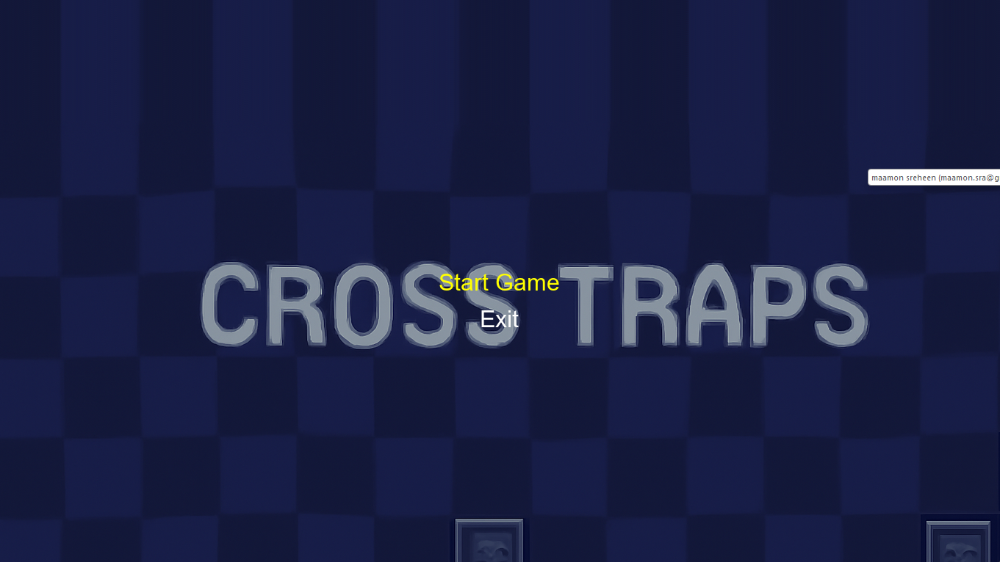
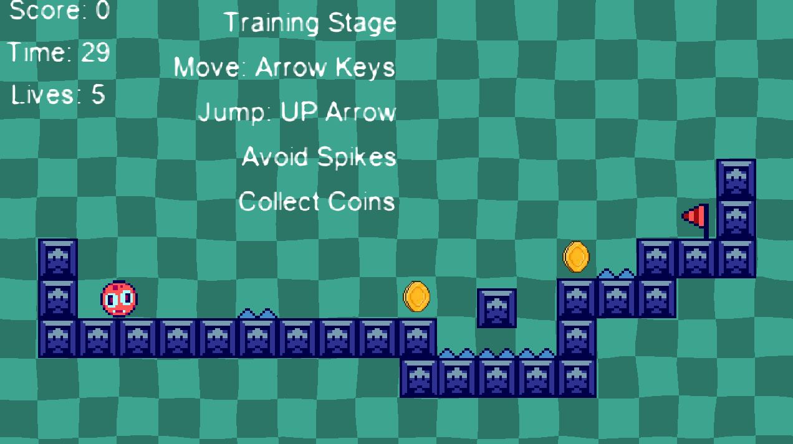
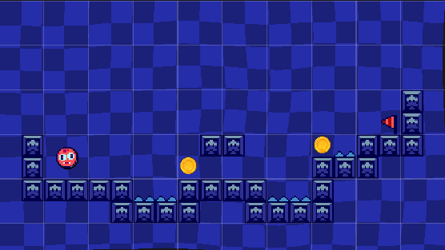
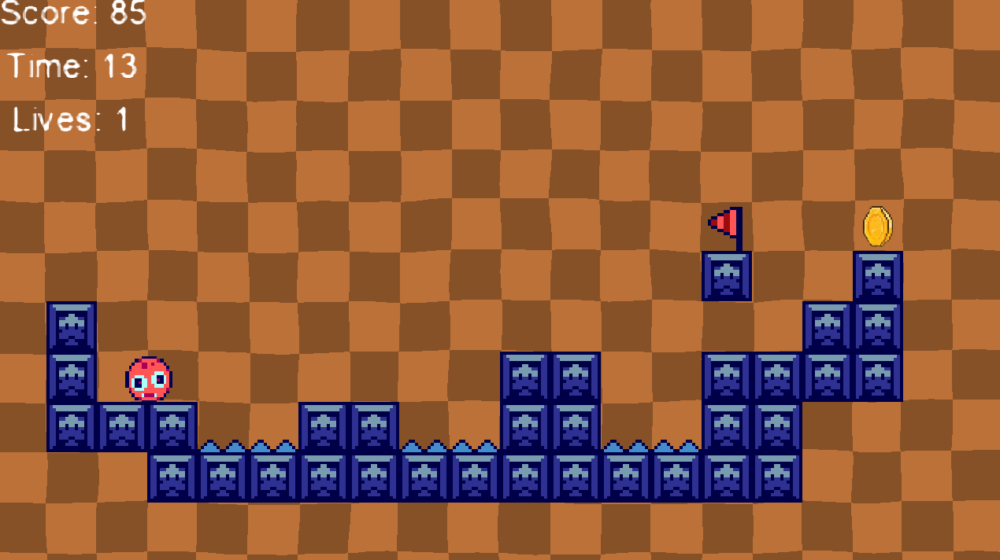
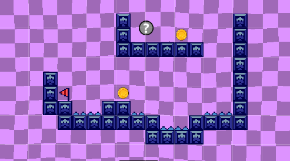
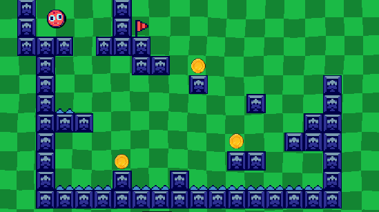
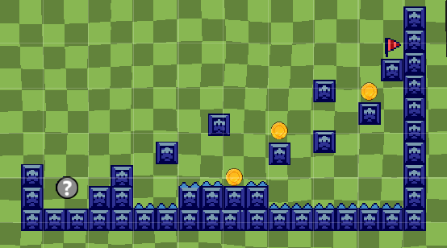

<div align="center">

# 🎮 Cross Traps: 2D Precision Platformer

**A Retro-Inspired 2D Obstacle Avoidance & Precision Platformer Game Built with GameMaker & GML**

[](https://gamemaker.io/)
[-3598DC?style=for-the-badge)](https://manual.gamemaker.io/)
[]()
[]()
[]()
[](LICENSE)

</div>

---

## 📌 Overview

**Cross Traps** is a fast-paced 2D precision platformer engineered in **GameMaker Studio 2** utilizing **GameMaker Language (GML)**. The game challenges players to navigate across 7 progressively difficult obstacle-filled rooms featuring deadly spikes, tight jump mechanics, strict countdown timers, and reward coins.

This project exemplifies the complete **Game Development Life Cycle (GDLC)**—from initial prototype mechanics (**Version 1.0**) to a polished multi-level experience (**Version 2.0**) featuring custom physics algorithms, checkpoint respawn systems, damage cooldown invincibility, interactive HUD rendering, and dynamic audio integration.

---

## 🔄 Version Evolution (v1.0 ➔ v2.0)

| Feature / System | Version 1.0 (Prototype) | Version 2.0 (Full Release) |
| :--- | :--- | :--- |
| **Level Progression** | Single test level | 7 unique handcrafted challenge rooms (\Room1\ to \Room7\) |
| **Timer System** | Static timer | Dynamic room-specific countdown limits (30s down to 15s) |
| **Respawn Logic** | Full room restart on death | Dynamic start-point checkpoint respawning (\oStartPoint\) |
| **Damage System** | Instant death / multiple life loss | 60-frame invincibility cooldown (\hitDelay\) + score penalty |
| **Audio & SFX** | Basic audio | Integrated atmospheric background tracks & sound effects |
| **User Interface** | Plain text display | Styled Main Menu (\
mMainMenu\), interactive buttons, and real-time HUD |
| **Game Architecture** | Basic event triggers | Decoupled object-oriented GML scripts with state controllers |

---

## 🕹️ Core Gameplay Mechanics

### 🏃 1. Precision Movement & Physics
- Custom horizontal and vertical velocity management with realistic gravity acceleration (\ysp += 0.1\).
- Pixel-perfect solid collision handling with \move_and_collide()\ avoiding clipping or stuck states.

### ⚠️ 2. Hazard & Life Economy
- **Spike Collisions (\oSpike\):** Deducts 1 life (\global.lives -= 1\) and 5 points (\global.score -= 5\).
- **Invincibility Cooldown:** 1-second (60 frames) grace period after taking damage to prevent instant life loss.
- **Checkpoint Fallback:** Players with remaining lives respawn at the room's start point; losing all lives resets progress to checkpoint milestones (\Room1\ or \Room2\).

### ⏱️ 3. Dynamic Room Countdown Timers
- Every room enforces a tight countdown window (\[30s, 30s, 25s, 20s, 20s, 15s]\), balancing speedrunning with cautious platforming.

### 🪙 4. Collectibles & Progression
- **Gold Coins (\oCoin\):** Grants +20 bonus score to reward skilled navigation.
- **Victory Flag (\oFlag\):** Triggers room completion, leading to the endgame victory sequence in \Room7\ and automatic return to the Main Menu.

---

## 📸 Screenshots & Gameplay Walkthrough

<div align="center">

### Main Menu Interface

*Title screen with Start Game and navigation controls.*

</div>

| Room 1: The Introductory Ascent | Room 2: First Milestone Checkpoint |
| :---: | :---: |
|  |  |
| *Learning jump arcs and coin collection* | *Precision jumps over ground spike hazards* |

| Room 3: Tight Hazard Navigation | Room 4: Speedrun Challenge |
| :---: | :---: |
|  |  |
| *Multi-tier spike avoidance with restricted timers* | *Fast vertical leaps under tight 20-second countdown* |

| Room 5: Platform Precision | Room 7: Final Gauntlet & Victory Flag |
| :---: | :---: |
|  |  |
| *Advanced obstacle layout requiring frame-perfect timing* | *The ultimate test leading to game completion* |

---

## 🎮 Controls

| Action | Primary Key | Alternate Key |
| :--- | :--- | :--- |
| **Move Left** | Left Arrow (\←\) | \A\ |
| **Move Right** | Right Arrow (\→\) | \D\ |
| **Jump** | Up Arrow (\↑\) | \W\ / \Space\ |
| **Restart Room** | Automated on Timeout / Zero Lives | — |

---

## 📂 Project Structure

```	
cross-traps-2d-platformer/
├── assets/
│   └── screenshots/                # Gameplay and room screenshots
│       ├── main_menu.png
│       ├── room1.png
│       ├── room2.png
│       ├── room3.png
│       ├── room4.png
│       ├── room5.png
│       ├── room6.png
│       └── room7.png
├── docs/                           # Game design documents & BTEC development reports
├── game/                           # Version 2.0 GameMaker Studio 2 Project
│   ├── objects/                    # Game objects (oPlayer, oSpike, oCoin, oFlag, oMainMenu)
│   ├── rooms/                      # Level rooms (rmMainMenu, Room1 - Room7)
│   ├── sprites/                    # 2D pixel art sprites and animations
│   ├── sounds/                     # Sound effects and background music
│   ├── tilesets/                   # Level tileset maps
│   ├── fonts/                      # Retro display fonts
│   └── cross_traps_v2.yyp          # GameMaker Project File
├── legacy/                         # Version 1.0 prototype source code
│   └── v1.0/
├── .gitignore                      # GameMaker temporary file exclusions
├── LICENSE                         # MIT License
└── README.md                       # Project documentation
```

---

## 🚀 How to Run & Play

### Option 1: Run via GameMaker Studio 2 (For Developers)
1. Download and install [GameMaker](https://gamemaker.io/).
2. Clone this repository:
   `ash
   git clone https://github.com/your-username/cross-traps-2d-platformer.git
   `
3. Open GameMaker Studio 2 and select **Open Project**.
4. Navigate to \game/\ and select \cross traps_v2.yyp\.
5. Press **F5** (or click the Run button) to compile and play!

### Option 2: Standalone Windows Executable
- Download the compiled \.exe\ directly from the [Releases](https://github.com/your-username/cross-traps-2d-platformer/releases) section (no GameMaker installation required).

---

## 📄 License

This project is open-source and licensed under the [MIT License](LICENSE).

---

## 👨‍💻 Author

Developed by **Mamoun Sraiheen**  
*Passionate Game Developer & Computer Science Student*
